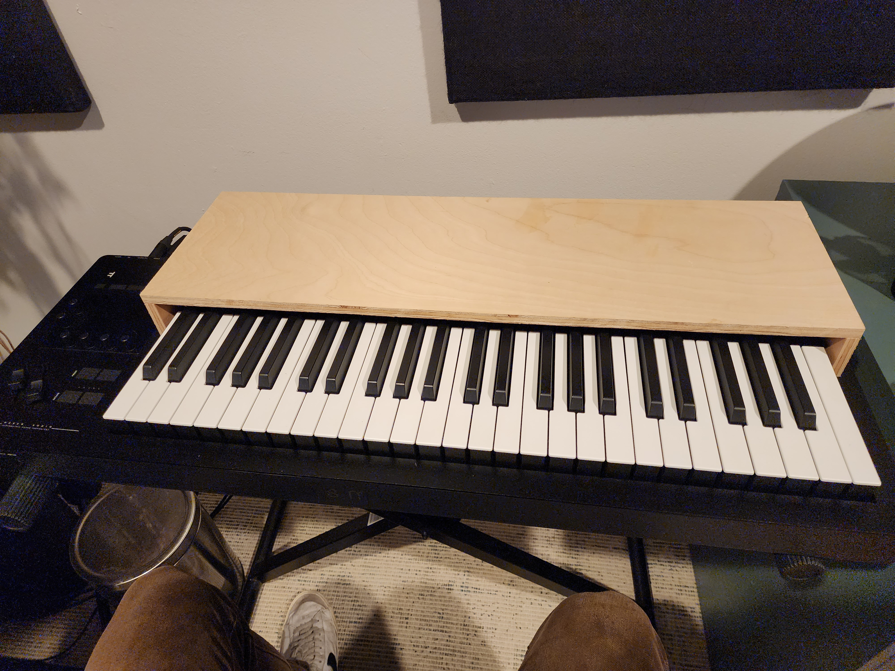
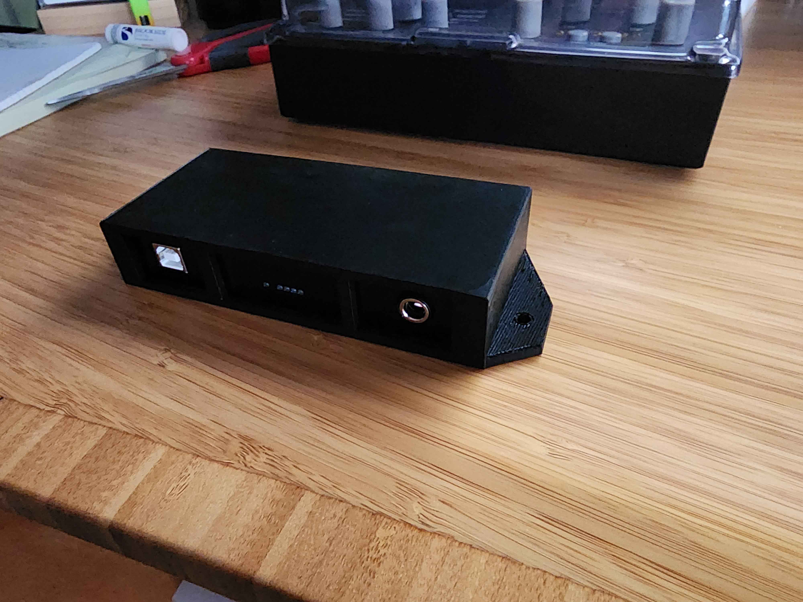
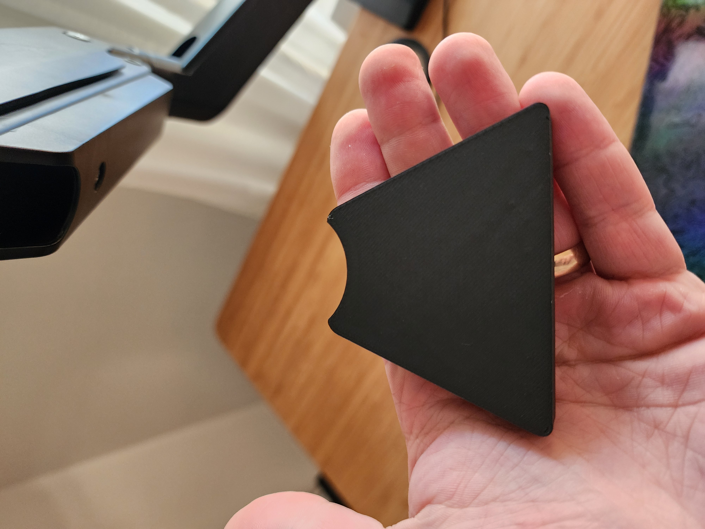
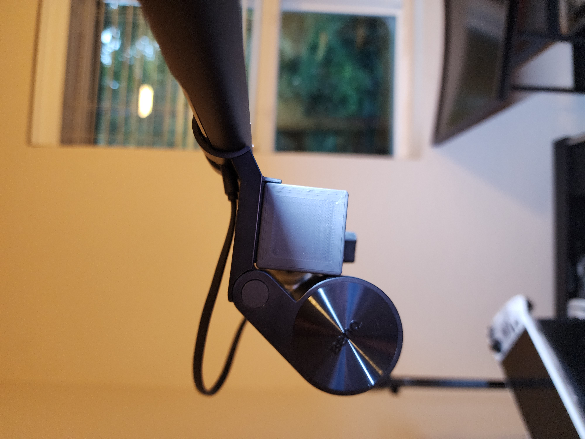

# Terminus Project

A collection of projects for organization and creative space optimizations that I use in my day to day life.

- [Terminus Project](#terminus-project)
	- [TODO](#todo)
	- [Project Plans](#project-plans)
		- [Osmose Bench](#osmose-bench)
		- [Desk Patchbay](#desk-patchbay)
	- [Stands, Mounts, and Covers](#stands-mounts-and-covers)
		- [RME - Digiface USB Mount](#rme---digiface-usb-mount)
		- [Generic Monitor Arm Blocks](#generic-monitor-arm-blocks)
		- [Generic Camera Cube Mount](#generic-camera-cube-mount)
	- [Organization/Gridfinity](#organizationgridfinity)
	- [Reference and Links](#reference-and-links)

## TODO

- [ ] Proper project photoshoots
- [ ] Documentation
  - [ ] Make sure all of the specs sizes are correct
- [ ] Re-design mounts
  - [ ] RME Digiface
  - [ ] Saberent 7-port USB hub
- [ ] Set up github release infrastructure
- [ ] Gridfinity bins and specialty holders

## Project Plans

There are a handful of DIY project plans. These are anywhere between; a jumping off point and a completely replicatable set of plans. Approach at your own risk :)

### Osmose Bench

A handy bench/cover for the `Osmose` by `Expressive E`. Included is a step by step [build guide](./src/osmose_bench/osmose_bench_build_guide.pdf) (found under `/osmose_bench` in the release package) for building this for yourself.

### Desk Patchbay

Putting a hole in your desk is a commitment.

## Stands, Mounts, and Covers

A large chunk of this package is 3D printable things.

All `.stl` and `.3mf` files are provided as a `release`. All of the goods are packaged in a consumer friendly format. Alternatively, you can clone this package and find them `src/mounts/`.

### RME - Digiface USB Mount

**BOM:**

- 1x `digiface_mount` part
- 1x RME Digiface USB interface
- 3x `` screws

**Specs:**

- `120mm` x `55mm` x `20mm` footprint
- `8mm` diameter space for screw heads with counter sinks

**Assembly:**

1. Using the mount, mark hole locations.
2. Drill pilot holes
3. Place the digiface into the mount
4. Screw mount into place

### Generic Monitor Arm Blocks

A range of sizes to account for some common monitor arm/vesa mount dimensions.

**BOM:**

- 1x `monitor_arm_block` part

**Specs:**

- Ranging from `35mm` to `75mm` in length
- `30mm` diameter x `15mm` tall, `20` degree collar for the monitor arm
- `60mm` x `15mm` vesa plate interface

### Generic Camera Cube Mount

**BOM:**

- 1x `camera_cube_mount` part
- 1x `M6` heatset insert

**Specs:**

- `35mm` cube
- `M6` threaded insert

**Assembly Plan:**

*NOTE: Go slow with the heatset insert. It takes a while to warm up the insert and the plastic since the interface between the two is so large. Putting too much pressure on before the parts are heated up enough can result in deformed plastic and/or a weak connection between the insert and plastic part.*

1. Using a soldering iron or heatset insert press, embedd a `M6` insert into the block.

## Organization/Gridfinity

All baseplates, clips, and generic boxes were generated by [Gridfinity generator](https://gridfinitygenerator.com/en/baseplate).

Baseplates support 6x2mm circular magnets

TODO: write this

## Reference and Links

- [Gridfinity generator](https://gridfinitygenerator.com/en/baseplate) for baseplates, clips, and boxes
- [pandoc](https://pandoc.org/)+[MiKTeX](https://miktex.org/) or [Markdown PDF](https://marketplace.visualstudio.com/items?itemName=yzane.markdown-pdf) vs code extension to generate `pdf` documentation.
